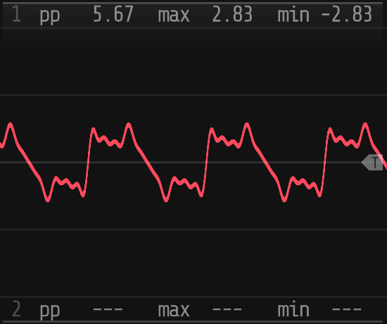

# Loom

## Specs

- 18HP
- 12 CV Inputs (8 attenuverted)
- 4 Outputs

## Video Demo

TODO

## Overview

Loom is an additive synthesizer voice & modulation source based loosely on the concept of [Euclidean rhythms](https://en.wikipedia.org/wiki/Euclidean_rhythm). Rather than using Euclidean rhythms to generate gate or trigger patterns, Loom uses them to determine which spectra make up the waveform it synthesizes by adding up individual sinusoids. For example, the Euclidean pattern with length of `11` and density of `7` is `XOXXOXXOXXO` (where `X` is an "on" step and `O` is an "off" step). In Loom, this would translate to a waveform where harmonics 1, 3, 4, 6, 7, 9, and 10 are active. By default all harmonics are generated at their sawtooth amplitude (`1/n`). See _Figure 1_ for the associated waveform and spectrum of Loom with length `11` and density `7`.

_Fig. 1: The waveform (left) and spectrum (right) of the additive waveform based on the Euclidean pattern with length of 11 and density of 7._

## Harmonic Structure Section

The harmonic structure section of Loom is where the core of its additive synthesis based on Euclidean patterns occurs.

_Fig. 2: Loom's harmonic structure section._

### Count

**Count** is controlled via its main knob _(2)_, its associated CV input _(10)_, and its CV attenuverter _(1)_. It sets the length of the pattern used to generate additive synthesis partials and ranges from `1` partial (just the fundamental) to `64` partials. Most of the time this knob controls how "bright" the resulting sound will be, with lower values only exercising the lower harmonics of the fundamental frequency.

### Density

**Density** is controlled via its main knob _(4)_, its associated CV input _(11)_, and its CV attenuverter _(3)_. It sets the number of active partials in the range of partials specified by **Count** between `1` and the value of **Count**, following the rules of Euclidean pattern generation. This control has a profound impact on the timbre of the resulting sound. Scanning near the center of the **Density** knob one can find waves containing only odd or even harmonics. At its maximum value the output will be an approximation of a sawtooth wave with **Count** functioning like the cutoff of a lowpass filter.

### Shift

**Shift** is controlled via its main knob _(6)_, its associated CV input _(12)_, and its CV attenuverter _(5)_. This control shifts patterns up through the harmonics. Sweeping this knob creates a spectral rippling effect similar to a very fine-toothed comb filter.

### Stride

**Stride** is controlled via its main knob _(8)_, its associated CV input _(13)_, and its CV attenuverter _(7)_. **Stride** changes the harmonic relationship between the fundamental frequency and all other partials. At `1`, which will light up the LED near that knob position _(14)_, each partial will be at `N * freq`, where `N` is that partial's number and `freq` is the fundamental frequency i.e. a normal harmonic series. Values above `1` will spread the partials out further and values below `1` will clump them closer to the fundamental. **Stride** has 3 different modes determined by the **Continuous Stride Switch** _(9)_.

#### Continuous Stride Mode = Off

**Stride** will snap to integer values:

- `0`: A very loud single sinusoid
- `1`: Normal harmonic spacing
- `2`: Odd harmonics only
- `3`: Alternating even and odd harmonics with wide gaps
- `4`: Odd harmonics only with wide gaps

#### Continuous Stride Mode = Sync

**Stride** will sweep continuously but all partials will be hard-synced to the fundamental frequency. This mode has sonic characteristics similar to traditional hard sync but slightly different due to the inharmonic relationships of the partials at non-integer **Stride** values.

#### Continuous Stride Mode = On

This is a fully free-running mode. Because all partials can phase against each other this mode is good for synthesizing inharmonic bell-like sounds. At **Stride** values near an integer there will be pleasing subtle movement in the output waveform.

### Morphing

While Euclidean patterns are specified by integer values, all 3 of the **Length**, **Density**, and **Shift** parameters are continuous and will crossfade between adjacent patterns. In this way one could consider them as a cursor into a 3D "wavetable" of partials.

## Pitch Control Section

TODO

## Spectral and Amplitude Shaping Section

TODO

## Output Configuration Section

TODO

## Sync and Ping

TODO

## Questions/feedback?

Please open an issue on this GitHub repository with unanswered questions or feedback!