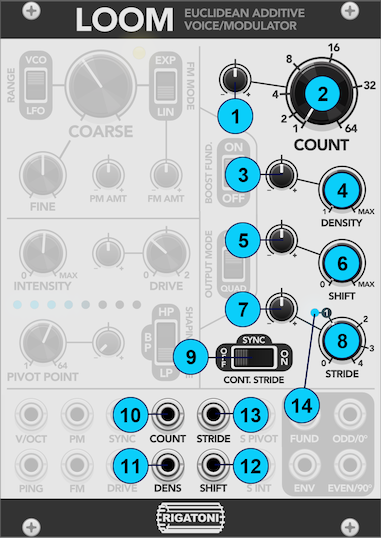
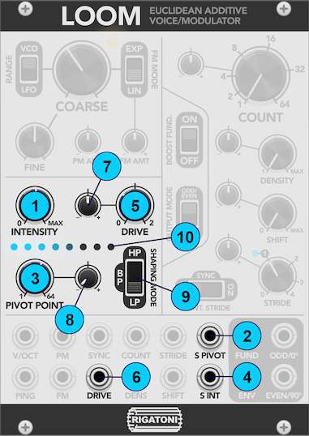

# Loom

## Specs

- 18HP
- 12 CV Inputs (8 attenuverted)
- 4 Outputs

## Video Demo

Coming soon!

## Overview

Loom is an additive synthesizer voice & modulation source based loosely on the concept of [Euclidean rhythms](https://en.wikipedia.org/wiki/Euclidean_rhythm). Rather than using Euclidean rhythms to generate gate or trigger patterns, Loom uses them to determine which spectra make up the waveform it synthesizes by adding up individual sinusoids. For example, the Euclidean pattern with length of `11` and density of `7` is `XOXXOXXOXXO` (where `X` is an "on" step and `O` is an "off" step). In Loom, this would translate to a waveform where harmonics 1, 3, 4, 6, 7, 9, and 10 are active. By default all harmonics are generated at their sawtooth amplitude (`1/n`). See _Figure 1_ for the associated waveform and spectrum of Loom with length `11` and density `7`.

_Fig. 1: The waveform (left) and spectrum (right) of the additive waveform based on the Euclidean pattern with length of 11 and density of 7._

## Harmonic Structure Section

The harmonic structure section of Loom is where the core of its additive synthesis based on Euclidean patterns occurs.

_Fig. 2: Loom's harmonic structure section._

### Count

**Count** is controlled via its main knob _(2)_, its associated CV input _(10)_, and its CV attenuverter _(1)_. It sets the length of the pattern used to generate additive synthesis partials and ranges from `1` partial (just the fundamental) to `64` partials. Most of the time this knob controls how "bright" the resulting sound will be, with lower values only exercising the lower harmonics of the fundamental frequency.

### Density

**Density** is controlled via its main knob _(4)_, its associated CV input _(11)_, and its CV attenuverter _(3)_. It sets the number of active partials in the range of partials specified by **Count** between `1` and the value of **Count**, following the rules of Euclidean pattern generation. This control has a profound impact on the timbre of the resulting sound. Scanning near the center of the **Density** knob one can find waves containing only odd or even harmonics. At its maximum value the output will be an approximation of a sawtooth wave with **Count** functioning like the cutoff of a lowpass filter.

### Shift

**Shift** is controlled via its main knob _(6)_, its associated CV input _(12)_, and its CV attenuverter _(5)_. This control shifts patterns up through the harmonics. Sweeping this knob creates a spectral rippling effect similar to a very fine-toothed comb filter.

### Stride

**Stride** is controlled via its main knob _(8)_, its associated CV input _(13)_, and its CV attenuverter _(7)_. **Stride** changes the harmonic relationship between the fundamental frequency and all other partials. At `1`, which will light up the LED near that knob position _(14)_, each partial will be at `N * freq`, where `N` is that partial's number and `freq` is the fundamental frequency i.e. a normal harmonic series. Values above `1` will spread the partials out further and values below `1` will clump them closer to the fundamental. **Stride** has 3 different modes determined by the **Continuous Stride Switch** _(9)_.

#### Continuous Stride Mode = Off

**Stride** will snap to integer values:

- `0`: A very loud single sinusoid
- `1`: Normal harmonic spacing
- `2`: Odd harmonics only
- `3`: Alternating even and odd harmonics with wide gaps
- `4`: Odd harmonics only with wide gaps

#### Continuous Stride Mode = Sync

**Stride** will sweep continuously but all partials will be hard-synced to the fundamental frequency. This mode has sonic characteristics similar to traditional hard sync but slightly different due to the inharmonic relationships of the partials at non-integer **Stride** values.

#### Continuous Stride Mode = On

This is a fully free-running mode. Because all partials can phase against each other this mode is good for synthesizing inharmonic bell-like sounds. At **Stride** values near an integer there will be pleasing subtle movement in the output waveform. At high settings of **Drive** (see the [Spectral & Amplitude Shaping Section](#spectral--amplitude-shaping-section)) this movement may clip rhythmically which can be a nice effect.

### Morphing

While Euclidean patterns are specified by integer values, all 3 of the **Length**, **Density**, and **Shift** parameters are continuous and will crossfade between adjacent patterns. In this way one could consider them as a cursor into a 3D "wavetable" of partials.

## Pitch Control Section

_Fig. 3: Loom's pitch control section._

Loom's pitch control section features several standard (and less standard) oscillator features. The **Range** switch _(3)_ switches between LFO range and VCO range. The **Coarse Tune** knob _(1)_ spans from 320 seconds/cycle to 25Hz in LFO mode and from 1.25Hz to 10kHz in VCO mode. The **Fine Tune** knob _(2)_ spans from half frequency to double frequency in LFO mode and from -7 semitones to +7 semitones in VCO mode. The oscillator core indicator LED _(7)_ will flash to show the fundamental frequency of Loom.

The **V/OCT** CV input _(8)_ acts as a 1 volt/octave pitch control. Loom can accept either linear or exponential FM on the **FM** CV input _(10)_ based on the state of the **FM Mode** switch _(4)_. Linear FM can go [through zero](https://learningmodular.com/understanding-the-differences-between-exponential-linear-and-through-zero-fm/). The **FM Amount** attenuverter _(5)_ scales this modulation. Loom also accepts linear phase modulation on the **PM** CV input _(9)_, scaled by the **PM Amount** attenuverter _(6)_.

## Spectral & Amplitude Shaping Section

_Fig. 4: Loom's spectral & amplitude shaping section._

Loom's spectral & amplitude shaping section consists of two main elements: a spectral filter and a drive amplifier/waveshaper.

The spectral filter's cutoff frequency (pivot point) can be centered around any of the 64 partials using the **Pivot Point** knob _(3)_, which has the same knob scaling as **Count**. The spectral pivot can be modulated using the **S Pivot** CV input _(2)_, this modulation being scaled by an attenuverter _(8)_. The slope of the spectral filter is controlled by **Intensity** _(1)_ and its corresponding CV input _(4)_. At `0` the slope will be flat (no shaping) and at `MAX` the slope will be very steep. The spectral filter's mode can be switched between `Lowpass`, `Bandpass`, and `Highpass` using the **Shaping Mode** switch _(9)_. Notably, all spectral shaping happens before drive or hard sync, so interesting effects can be achieved by combining these features.

The drive amplifier/waveshaper has its gain controlled by the **Drive** knob _(5)_, its associated CV input _(6)_, and its attenuverter _(7)_. This setting only applies to the 2 main outputs. Depending on other panel settings you may need more or less drive to achieve a 10Vpp output signal; **Loom has no automatic gain compensation to make it a more expressive voice**. At higher values of **Drive** the 2 main outputs will start to clip through a quadratic soft clipping stage.

This section also features an LED array _(10)_ indicating the amplitudes of all partials. Each LED represents a group of 8 partials. Their brightnesses are affected by the harmonic shaping section, the spectral filter, and any band-limiting effects which cull harmonics over the [Nyquist frequency](https://en.wikipedia.org/wiki/Nyquist_frequency) (with a smooth falloff starting at 0.75x Nyquist).

## Outputs & Output Configuration Section

_Fig. 5: Loom's outputs & output configuration section._

Loom has 4 outputs:

- **ODD/0°** _(3)_ is the 1st main output of Loom. When **Output Mode** _(2)_ is set to "Odd/Even" it will contain only odd harmonics. In "Quad" (Quadrature) mode it will contain all harmonics (according to the spectral and harmonic shaping settings).
- **EVEN/90°** _(4)_ is the 2nd main output of Loom. When **Output Mode** _(2)_ is set to "Odd/Even" it will only contain even harmonics along with the fundamental frequency. In "Quad" mode it will be a 90° phase-shifted version of the **ODD/0°** output.
- **FUND** _(5)_ is the fundamental frequency of the oscillator, a simple sine wave. It's not affected by any of the spectral, amplitude, or harmonic shaping parameters. It still responds to all pitch-related parameters as well as hard sync.
- **ENV** _(6)_ is a copy of the internally-generated **PING** signal and spans a 0V-8V range.

The **Boost Fundamental** switch _(1)_ will keep the fundamental frequency from being completely silenced even at spectral shaping and/or shift settings where it normally would not be present.

## Sync & Ping

Loom has a hard **SYNC** input that allows its phase to be reset every time the signal at this input rises above 0V. Loom also features a "Ping" input. Patching a short trigger to this input will produce a short, plucky envelope at the **ENV** output. Even better, this envelope is normalled to any unpatched CV inputs with a dedicated attenuverter (**PM**, **FM**, **COUNT**, **DENSITY**, **SHIFT**, **STRIDE**, **DRIVE**, **S PIVOT**). Feel free to mult the **ENV** output to any other inputs too! **PING** will also respond to non-trigger signals so feel free to experiment.

## Right-Click Settings

Loom has a few right-click settings that modify the quality of its synthesis algorithms. We recommend default settings for these parameters for performance reasons but they can be modified for even higher quality synthesis or grittier sounds.

### Oversampling

Oversampling defaults to **Off** and controls whether or not Loom's synthesis will be calculated at a higher sample rate than VCV Rack's configured sample rate. Given that Loom already does a lot of computation to produce its outputs we recommend keeping it turned off for performance reasons. If you're using Loom with very heavy audio-rate modulation and find that you're experiencing an unacceptable amount of aliasing consider switching it to **2x**.

### Drive ADAA

This option controls whether or not Loom's non-linear drive emulation has antiderivative anti-aliasing applied. This only incurs a small performance hit so it's enabled by default. If you want a more gritty digital aliased sound you can disable it and crank up the drive.

### BLEP Anti-Aliasing

This option controls how many derivatives of "band-limited step anti-aliasing" are applied to Loom's outputs under hard sync or in synced continuous stride mode. There's practically no performance hit between any of the settings between **0th Order** and **3rd Order** so for best quality we recommend a default of **3rd Order**. For grittier digital aliased sounds with sync you can disable this setting.

## Questions/feedback?

Please open an issue on this GitHub repository with unanswered questions or feedback!

## References

- [Antiderivative Anti-Aliasing](https://ccrma.stanford.edu/~jatin/Notebooks/adaa.html)
- [Sine Sync](https://www.native-instruments.com/fileadmin/ni_media/downloads/pdf/SineSync.pdf)
- [Euclidean Rhythms](https://medium.com/code-music-noise/euclidean-rhythms-391d879494df)
- [Sine Chebyshev Polynomial Approximation](https://web.archive.org/web/20200628195036/http://mooooo.ooo/chebyshev-sine-approximation/)