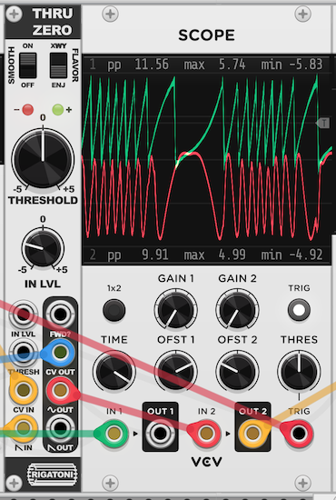

# ThruZero

A 4HP VCV Rack module based off [this ModWiggler topic](https://www.modwiggler.com/forum/viewtopic.php?t=277734) on how to patch up through-zero FM, stemming from the [X Without Y](https://modwiggler.com/forum/viewtopic.php?t=257278) book.

## Usage

### Standard Use (TZFM Emulation)

Patch a ramp wave carrier to the ramp input and adjust the input level to get a non-clipped 10Vpp ramp on the ramp output. Patch an FM modulator to the CV in. For most stable behavior, keep threshold at 12 o'clock. Patch CV out to FM in on your carrier (optionally through an attenuator). For best timbral effects, increase carrier frequency above modulator frequency. The carrier will essentially be soft (reversing) synced to the modulator. 

The main outputs of this module are the ramp and sine outs, which will be the emulated TZFM waveshaped outputs (sine is just the ramp out passed through a quadratic sine shaper and an optional spike removal stage). The `FWD?` output is a comparator output which will be high when the modulator is above the zero threshold and low otherwise. This output can be mixed in with the other outputs to provide a stronger fundamental.

The module has two "flavors", selectable using the switch in the upper right-hand corner of the panel. The default flavor is the "ENJ" flavor, which does reversing sync emulation for a more faithful TZFM sound. An alternative "XWY" (X without Y) flavor is available as well, which simply inverts the input wave when the modulator is below the zero threshold. This mode has a slightly different timbre, since there will be an additional discontinuity when inversion switches if the input waveform isn't at 0V. This mode doesn't require a ramp wave as an input and can act on any waveform.

The default "ENJ" flavor uses a ramp phase shifter, which produces a spike in the phase shifted ramp when the input ramp restarts its cycle. This artifact adds a high-frequency buzz to the timbre of the output. The `SMOOTH` switch turns on a spike-smoothing stage to remove most of this artifact. It also turns on an additional spike-smoothing stage in the sine shaper.

### As a Comparator

Patch an audio or CV signal into the CV input. The threshold knob acts as the base comparator threshold and the threshold CV input acts as an offset for the threshold. Use the `FWD?` output as the comparator output (0V low, 10V high).

## Demo



## Through Zero FM Emulation

Through Zero FM can be emulated (not perfectly, but pretty well) using a VCO that has a soft sync feature. That is, the oscillator core reverses direction when synced rather than dumping its capacitor(s) and resetting to 0.
Often the only VCOs with this feature are triangle-core VCOs; saw-core VCOs are more likely to have hard sync exclusively. When a VCO core is built with through zero FM, the direction of the
oscillator core reverses when the frequency goes "through zero" – the oscillator will stall and then reverse direction at 0 Hz. This is essentially soft sync at a specific frequency threshold, and avoids
some of the fundamental shifting effects of "normal" FM in the analog world. Using a comparator, some other scale/offset utilities, and an oscillator with soft sync, one can define an arbitrary level of the modulator signal
at which the carrier will reverse direction.

## An Explanation of the ThruZero Module's Inner Workings

This module takes as its 2 main inputs:
- A carrier ramp wave (falling or rising is fine, but there's also a bipolar VCA with up to 2x gain on the input)
- An FM modulator for the carrier

Its main outputs are ramp and sine waves with the same frequency (but potentially different phase and/or polarity) as the carrier, emulating
what would happen if the carrier ramp wave were being soft synced whenever the FM modulator goes below a CV-adjustable threshold. It also outputs
the input modulator signal, reflected above the through zero point.

The first tool required for emulating soft sync on a ramp wave is a ramp phase shifter. This functionality has been implemented in multiple
analog Eurorack modules (e.g. the [Happy Nerding FM Aid](https://happynerding.com/category/fm-aid/) and the [Malekko Richter Oscillator II](https://malekkoheavyindustry.com/product/richter-oscillator-ii/)).
My favorite way to patch this up is outlined in the ModWiggler topic linked above and involves using a comparator threshold to create two offset waveforms which are
crossfaded between based on said threshold and blended with the original ramp. Note that this transformation produces a spike in the output waveform where the original
ramp wave's sharp rising or falling edge occurs. In this digital implementation I've added a mostly-successful but not perfect spike removal method using a low pass filter
on the output ramp controlled by an envelope follower following the high pass filtered original ramp.

Now, to emulate soft sync we need to invert the direction of the ramp (a simple inversion like one would do with an attenuverter) but also offset its phase so the inverted
ramp's current value matches what the uninverted ramp's current value was. Let's consider the case where we switch from a falling ramp with phase shift of `Φf` to a rising ramp
of phase shift `Φr`. In this case shifts are represented as values between **-5V** and **5V**. Aside: due to the nature of the comparator-based ramp phase shifter, rising ramps shift
"forward" in time while falling ramps shift "backwards" in time. After many pages of algebra that made me want to give up, I ended up with the following equation:

- `thresh'` = new comparator threshold for ramp phase shifter after soft sync
- `orig` = the original ramp value, before phase shifting
- `samp` = the value of the phase shifted ramp in its current polarity

```raw
thresh' = -(orig + samp + 5)
```

As you might be able to guess, this can often produce results outside of the desired **-5V** to **5V** threshold desired for the ramp phase shifter, so I just wrap the
result back to that range. I'm sure if I were marginally clever with my analysis I'd have a better equation. 

In any case, sampling and holding this new comparator threshold and flipping the polarity of our ramp (pre phase-shifter) gives us the effect we want! Patching the
modulator output to our carrier's FM input and listening to the ramp or sine outputs we get a pretty decent through zero FM sound. Curiously enough, _it almost seems
to work backwards from how i'd expect it to: increasing the frequency of the carrier keeps the fundamental constant and increases the harmonic content of the output, while
increasing the frequency of the modulator raises the fundamental accordingly._ I'm not sure why this happens.
